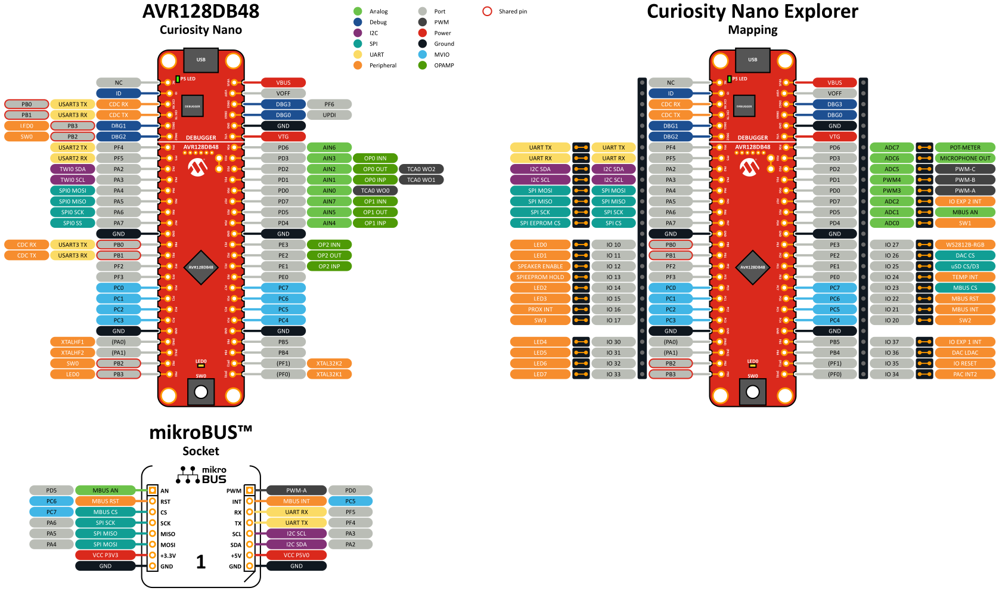

# AVR Programming Course
Welcome to the AVR Programming Course! This repository contains materials and exercises to help you learn how to program AVR microcontrollers using Visual Studio Code and the MPLABX Extension.

## 📜 Table of Contents
- [Prerequisites](#prerequisites)
- [Cloning the Course](#cloning-the-course)
- [Building and Running Your First Task](#building-and-running-your-first-task)
- [Useful links](#useful-links)
- [Pinout diagram](#pinout-diagram)
- [Acknowledgments](#acknowledgments)

## 🧰 Prerequisites
This course requires Visual Studio Code with the MPLABX Extension. If you haven't installed Visual Studio Code yet, follow the instructions below based on your operating system.

### Windows
[Download Visual Studio Code](https://code.visualstudio.com/) and install it.

### macOS (Homebrew)
If you use Homebrew, install Visual Studio Code using:
```sh
brew install --cask visual-studio-code
```
Alternatively, you can download VS Code from the [official website](https://code.visualstudio.com).

### Linux
You can download VS Code from the [official website](https://code.visualstudio.com/docs/setup/linux) or install it using your distribution’s package manager.

For Arch Linux:
```sh
sudo pacman -S code
```

## 📥 Cloning the Course
To get started, clone this repository using Git:
```sh
git clone https://github.com/oveljosland/microchip-avr-course.git
```
Alternatively, you can download the repository as a `.ZIP` file and extract it to your desired location.

## 🛠️ Building and Running Your First Task
1. Open Visual Studio Code.
2. Click on **File** → **Open Folder**, then select a task folder (e.g., `blink`).
3. Build the project using the shortcut:
   - **Windows/Linux:** `Shift + Ctrl + B`
   - **macOS:** `Shift + ⌘ + B`
4. Run the program using:
   - **Windows/Linux:** `Ctrl + F5`
   - **macOS:** `Control + F5`
  
## 🧐 Useful links
### Curiosity Nano 
- [Datasheet](https://ww1.microchip.com/downloads/aemDocuments/documents/MCU08/ProductDocuments/DataSheets/AVR128DB28-32-48-64-DataSheet-DS40002247.pdf)
- [Hardware User Guide](https://ww1.microchip.com/downloads/en/DeviceDoc/AVR128DB48-Curiosity-Nano-HW-UserG-DS50003037A.pdf)
- [TB3245 - Using 12-Bit ADC for Conversions, Accumulation, and Triggering Events](https://ww1.microchip.com/downloads/aemDocuments/documents/MCU08/ApplicationNotes/ApplicationNotes/12BitADC-Conv-Accumulation-Triggering-Events-DS90003245D.pdf)
- [TB3235 - Using 10-Bit DAC for Generating Analog Signals](https://ww1.microchip.com/downloads/aemDocuments/documents/MCU08/ApplicationNotes/ApplicationNotes/Using-10Bit-DAC-for-Generating-Analog-Signals-DS90003235C.pdf)
### Curiosity Nano Explorer
- [User Guide](https://onlinedocs.microchip.com/oxy/GUID-4910ECB5-7AD0-4572-B070-CCA2E253F3CB-en-US-1/index.html)

##  Pinout



## Acknowledgments
This project uses the following open-source libraries:

- [SSD1306 OLED Driver](https://github.com/marianhrinko/ssd1306) by **Marián Hrinko** – Licensed under the **MIT License**.
- [kissFFT](https://github.com/mborgerding/kissfft) by **Mark Borgerding** – Licensed under the **BSD-3-Clause License**.

For more details, see the [`THIRD_PARTY_LICENSES`](THIRD_PARTY_LICENSES) file.

